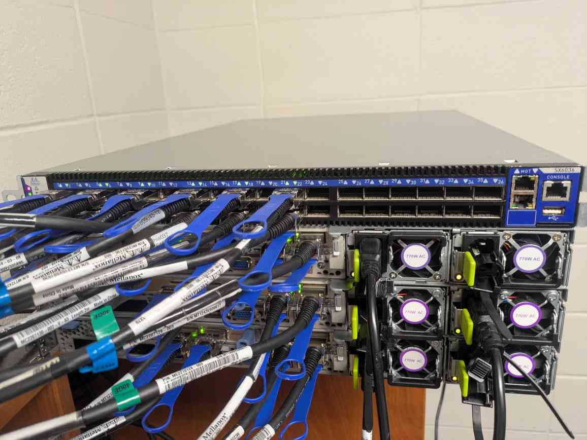
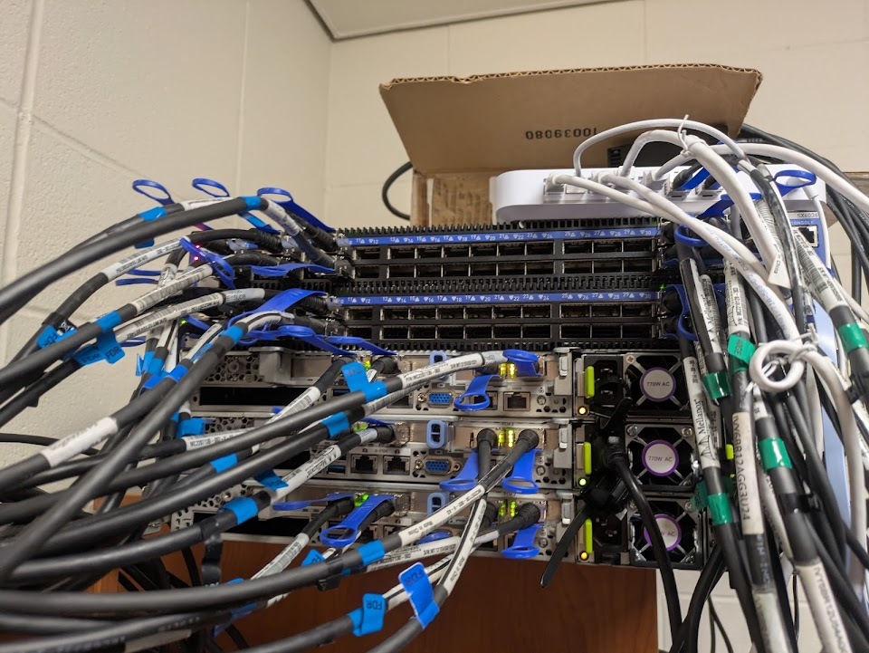
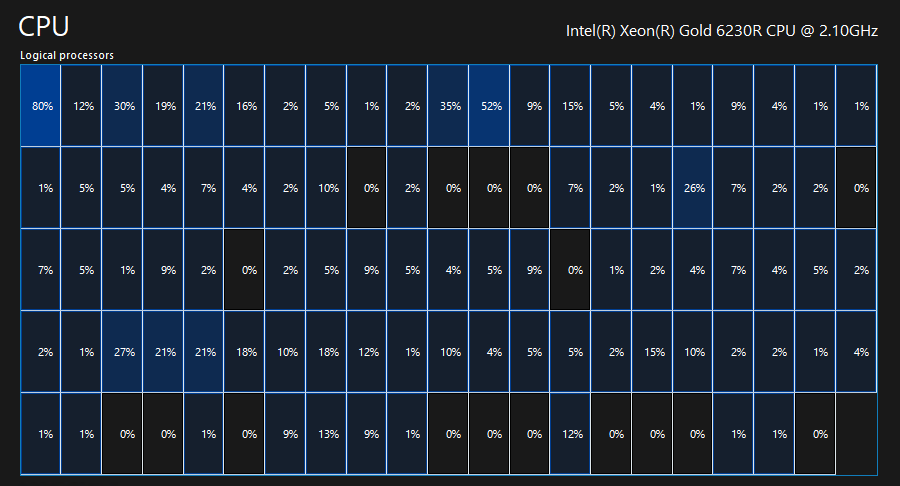
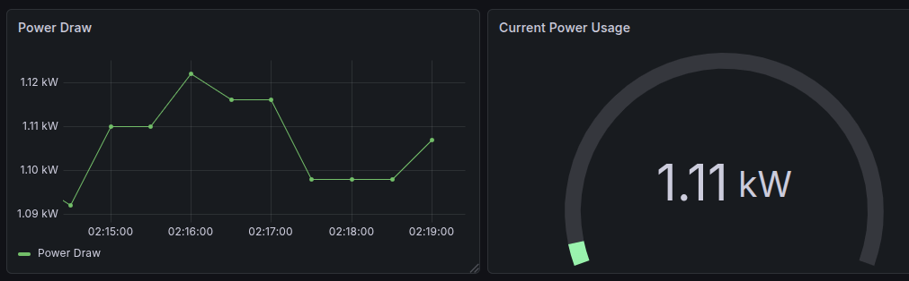

+++
title = 'Building a Datacenter in My Dorm Room'
date = '2026-07-06T18:23:42-05:00'
draft = false
+++
## Why?

I've had a small homelab, mainly of older desktops and workstations for a while now, but I have always dreamed of creating a high availability setup for my lab. I've also always wanted to try out Ceph and recently got very interested in high speed networking in a cluster. The only problem is that while doing this I was in a college dorm, but I was not going to let that stop me...

## Networking

The cluster started life off with a single Mellanox SX6036. That was it. I ordered a networking switch before I had a single machine in the cluster. This was mainly because I found that I could find these switches for about $100 used in working condition. What I was most excited about was being able to tinker around with the gear and at that point in time I was very interested in reverse engineering and performance engineering. Little did I know what I was getting myself into...

## Getting Something to Put on the Network: Compute

Around the same time I saw what was starting to happen to RAM and SSD pricing and decided to pull the trigger sooner than later so I bought three Cisco C220 M5s which were at a very decent price. They are 1U dual CPU servers based on Cascade Lake Intel Xeons. They arrived with:

- 2x Intel Xeon Silver 4216 (16C, 32T per CPU)
- 2x DDR4-2933 Registered ECC 32GB modules
- 2x 770W PSU

Overall I felt quite satisfied with this purchase and it has allowed me to do some interesting experiments on the cluster. I also needed some storage so apart from some pretty standard boot drives each node has a high endurance 3.84TB SAS SSD, to give Ceph 3 OSDs.

## Wiring

Things started getting a bit interesting at this point. I was able to set up most of the infrastructure (although slightly strange it is to manage, more on that in another post) but the wiring was a whole can of worms. I was looking for high-speed networking as for the VM transfer and Ceph storage use case having the bandwidth helps. Each one of the switches can do 4Tb/s of non-blocking switching throughput spread over 36 ports. The special thing about these switches is that they were originally sold for Infiniband FDR which is 56Gb/s, but they have a special mode that allows them to route Ethernet at these speeds as well. It also supports 40Gb/s which is more industry standard and is what I use to break out to 4x10G for the gateway.

The issue is the transceivers. To be able to route at the higher 56Gb/s speeds you need to have special cables for it, as well as having the ConnectX cards that support it. Luckily I was able to snag these for not too much which leaves me with my setup.

I decided to wire things a bit strange but I wanted to go for redundancy. Each server has 2 ConnectX-3 EN Pros with two ports each. That gives me 4 QSFP+ ports per server. Each one of the cards has a connection to the core switch so I can aggregate the bandwidth giving me about 224Gb/s through an LACP group. Each stream is capped to only one link but for most workloads many streams can be used across physical interfaces. It also provides redundancy at the cable and card level.

## More Redundancy

As if that was not enough, the servers are running a Proxmox cluster with a very basic Ceph cluster. Right now I have each server contain a 3.84TB SAS drive. This made one OSD per node to have three total (the bare minimum for a working replication style cluster). To all those sysadmins out there, I know, Ceph really should have more OSDs running and at least five nodes, I know. It's a homelab for a reason ;). But this also allows me to lose an entire server and everything would stay up, although Ceph would be degraded, it would still work.

Here's a photo of the cluster at this point:

## Why do you need this?

I am going to be honest. I don't. Nobody **NEEDS** networking this fast. Nobody **NEEDS** servers at home. But I wanted to play around with this hardware. I also justified it as a learning tool as it has allowed me to learn real world infrastructure concepts in my own lab environment, something which is hard to find from my classes. It also allows it to be a hobby to learn more and run any resource intensive software I would like to. And finally, because I can.

## Networking: The Next Generation

After a while of having it up and running I felt that it was missing some things. I needed to give it a proper gateway so I got a UniFi Cloud Gateway Fiber as the uplink and then this is where things start to get complicated. After that stabilized I decided to order another switch to do MLAG. For those unfamiliar, MLAG stands for multi-chassis link aggregation. Essentially each client connects to both switches through a shared 802.3ad group so if a switch fails the aggregated link stays up. In this case it supports a bog standard LACP group from a client perspective.

For wiring I decided to instead have a 4 port MLAG group for each server. Each switch has 2 ports within this group and each switch connects to both network cards. This allows for the network to stay up if 3/4 cables die, a switch dies, a network card dies. Some of these even in combination, such as an entire switch and network card. Reliability was the goal...

At least at the cluster level, let's not talk about the gateway that handles cross-VLAN traffic and internet routing as well as the power source. To be fair though the school dorms do have very reliable power.

## More Cores...

I wanted to upgrade the CPUs to have a few more cores and more importantly for me I was doing AVX-512 experiments and wanted a processor with more power for those workloads. Thus, I upgraded a server to have dual Xeon Gold 6230R CPUs. I wanted to stay below the 150W limit my current heatsinks and chassis were configured for so I felt this was a reasonable compromise. They have 26 cores each which makes for 104 threads total in the server as well as a higher boost clock and an additional AVX-512 FMA unit.

As a rational person one of the first things I did after this was fire up a Windows VM and screenshot task manager, and boy did it not disappoint.

## Power

The dorm's power was free so really wasn't my concern but here's a dashboard when maxing out all the servers.

It's no longer in my dorm sadly so now I am footing the bill... I don't consider it an expense really more of a learning investment.

## The End...

The whole point of this cluster is to learn and experiment in my own lab environment. I hope to post future experiments that I will do on the cluster. Until then, I thank you for reading about my crazy computer adventures.

PS: I'm sorry that this is a very jank server setup but it's my setup :). I hope to improve it soon and put it in an actual rack!